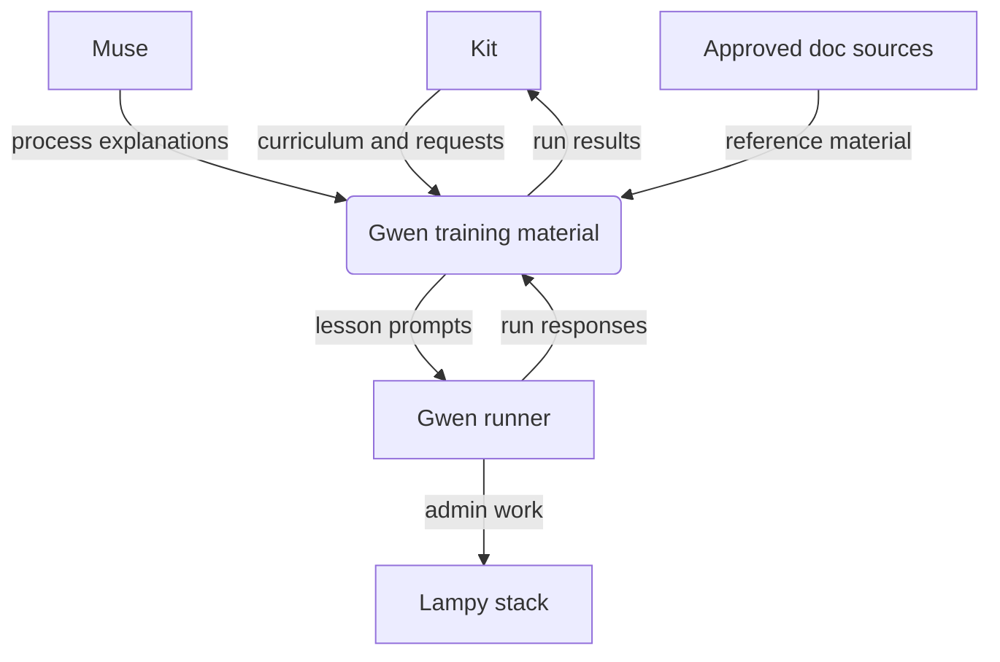
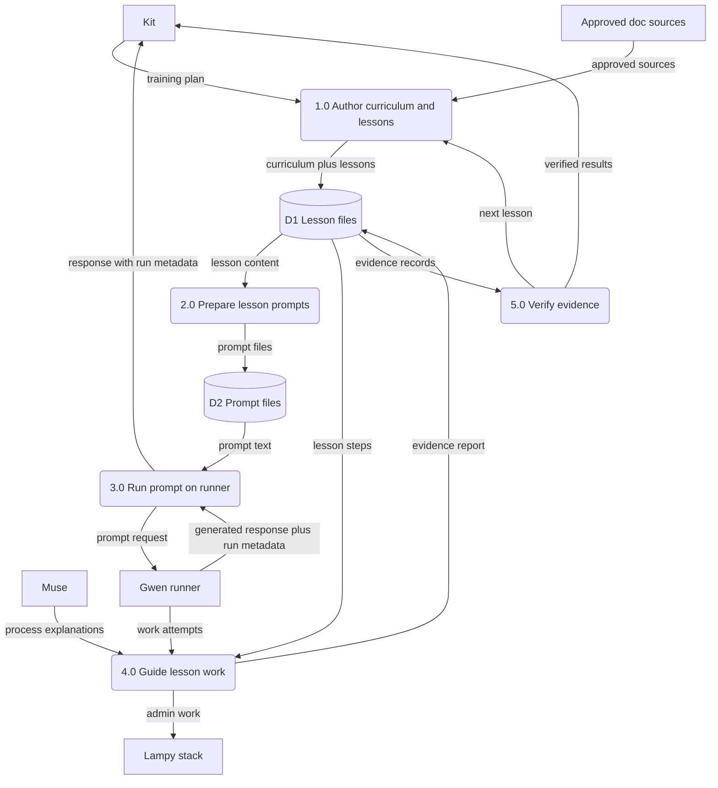
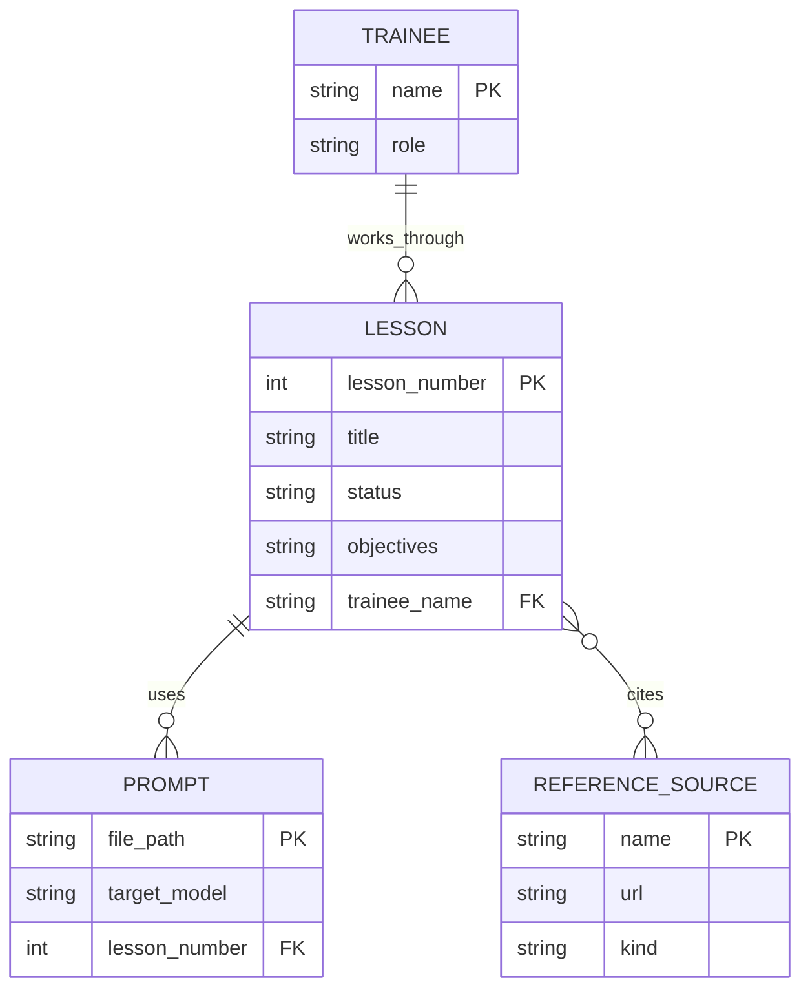

Living document — update these diagrams when adding features.

# gwen-training — Architecture

Training materials for **Gwen**, Kit's Lampy administrator-in-training
(Lampy home-server stack: PostgreSQL/TimescaleDB, Apache HTTPD, Apache
James mail server, supporting services). The repo is curriculum, lesson
files, prompts, and one runner script — there is no persistent data
model; lesson-run evidence is recorded as prose status in the lesson
files per the training rule.

## Current status (2026-09-28)

Training is **paused by Kit** — the Ollama stack is flaky and the
`gwen:latest` model was down at the morning retry. Lesson 3 paused at
turn 14; a retry is staged. The diagrams below describe the intended
pipeline, not currently-running work.

## 1. Context diagram (level 0)

## 2. Level-1 data flow diagram

## 3. Entity–relationship diagram

No persistent data model exists in this repo. The diagram above documents
the document types only — lessons, prompts, and reference sources as
files. Lesson-run evidence is recorded as prose status in the lesson
files per the training rule, not in a database.

## Grounding notes

- OBSERVED: 11 files on `main` — `README.md`, `LICENSE`,
  `00-curriculum.md`, `01-what-is-a-workflow.md`,
  `02-lesson-workflow-draft.md`, `03-mail-server-lesson.md`,
  `04-text-diagrams-lesson.md`, `lesson1-prompt.md`,
  `smoke-prompt.txt`, `gwen_ask.py`, `docs/architecture.md`.
- OBSERVED: the only commit since 2026-09-28 is `cb5f546a`
  (2026-09-28T21:23, "docs: add SAD architecture doc") — repo content is
  otherwise unchanged since 2026-09-26-era curriculum work.
- OBSERVED: README's training rule — Muse explains the process, Gwen
  does the work, she looks procedures up in approved references, and
  completion evidence is recorded honestly as proved/verified, tried, or
  failed.
- OBSERVED: `00-curriculum.md` — Lesson 1 Workflows (prepared:
  `01-what-is-a-workflow.md` reading, `02-lesson-workflow-draft.md` draft
  lesson loop with Gwen's first assignment to critique it); Lesson 2
  mail server (skeleton); Lesson 3 text-based diagrams (skeleton);
  later lessons planned but not written (webserver, per-system admin
  lessons, ClamWin scan task, firewall audit exercise, Python IDE).
- OBSERVED: `gwen_ask.py` POSTs the prompt file to
  `http://localhost:11434/api/generate` with `{"model": "gwen:latest",
  "stream": False}` and prints the response plus `---META---`
  `{done, total_duration, eval_count, prompt_eval_count}`.
- OBSERVED: approved sources (README) — local reference library
  (PostgreSQL 16 docs PDF, Debian Administrator's Handbook PDF) and
  official docs (`https://httpd.apache.org/docs/2.4/`,
  `https://james.apache.org/`, MicrosoftDocs GitHub sources).
- OBSERVED: Lesson 2 is real work, not an exercise —
  `03-mail-server-lesson.md` objective is creating her `gwen@localhost`
  mailbox, "the administrator identity she will use from now on."
- OBSERVED: `smoke-prompt.txt` — the runner smoke test is "Reply with
  exactly: Gwen online."
- OBSERVED (program records, 2026-09-28): Kit paused training — Ollama
  stack flaky, `gwen:latest` down at the morning retry; Lesson 3 paused
  at turn 14, retry staged. The "Current status" section above records
  this honestly; the diagrams describe the intended pipeline.
- INFERRED: `P5`'s "next lesson" output — the curriculum lists later
  lessons as planned, but no evidence-verification artifacts (reports,
  logs) exist in the repo; the loop's trigger is the training rule and
  `02-lesson-workflow-draft.md` (read, study, do, verify, report, log),
  not an observed file.
- INFERRED: `P4` → `E5` "admin work" — grounded in Lesson 2's objective
  (mailbox creation on the Lampy stack), but no admin-work output has
  been observed in the repo.
