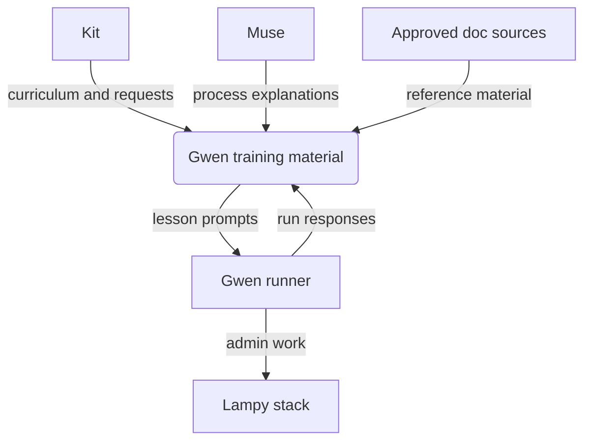
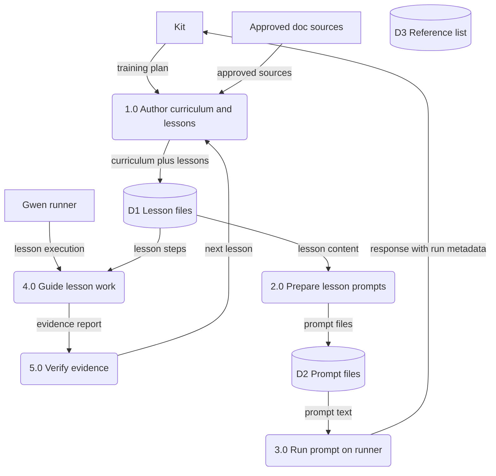
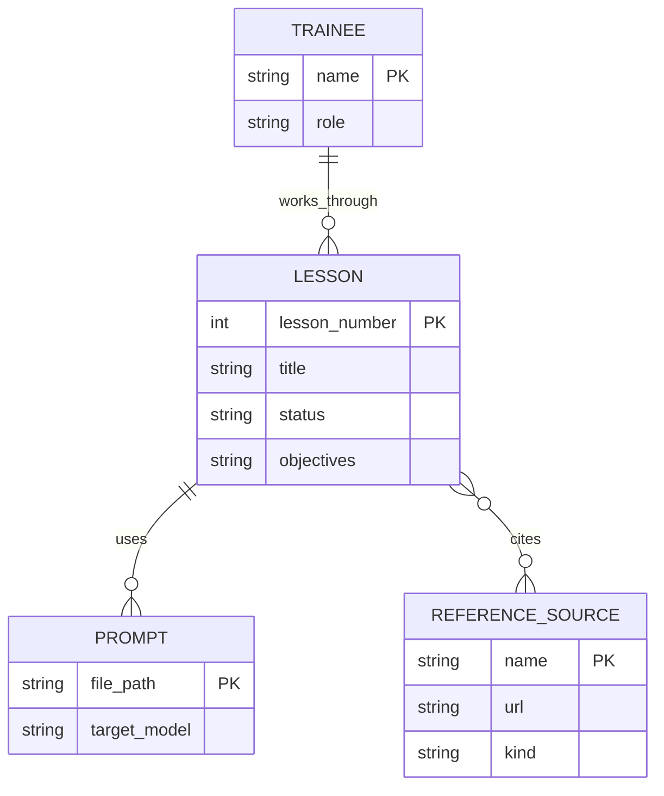

Living document — update these diagrams when adding features.

# gwen-training — Architecture

## 1. Context diagram (level 0)

## 2. Level-1 data flow diagram

## 3. Entity–relationship diagram

No persistent data model exists in this repo. The diagram above documents the document types only — lessons, prompts, and reference sources as files. Lesson-run evidence is recorded as prose status in the lesson files per the training rule, not in a database.

## Grounding notes

- OBSERVED: 10 files — `README.md`, `LICENSE`, `00-curriculum.md`, `01-what-is-a-workflow.md`, `02-lesson-workflow-draft.md`, `03-mail-server-lesson.md`, `04-text-diagrams-lesson.md`, `lesson1-prompt.md`, `smoke-prompt.txt`, `gwen_ask.py`.
- OBSERVED: README training rule — Muse explains the processes, Gwen does the work, she looks procedures up in approved references, and completion evidence is recorded honestly as proved or verified, tried, or failed.
- OBSERVED: `00-curriculum.md` is the lesson plan — Lesson 1 workflows prepared, Lesson 2 mail server skeleton, Lesson 3 text diagrams skeleton, later lessons planned but not written.
- OBSERVED: `gwen_ask.py` sends a prompt file to `http://localhost:11434/api/generate` with model `gwen:latest` and prints the response plus run metadata.
- OBSERVED: approved sources — local reference library (PostgreSQL 16 docs PDF, Debian administrator handbook PDF) and official docs (httpd.apache.org, james.apache.org, Microsoft docs).
- OBSERVED: Lesson 2 is real work not an exercise — the mailbox Gwen creates becomes her administrator identity on the Lampy stack.
- INFERRED: the response returned by the runner is shown to Kit but is not persisted in the repo; no lesson-run log store was observed.
- INFERRED: P5 evidence verification loop — the training rule and lesson workflow draft describe it, but no completed lesson evidence files were observed.
